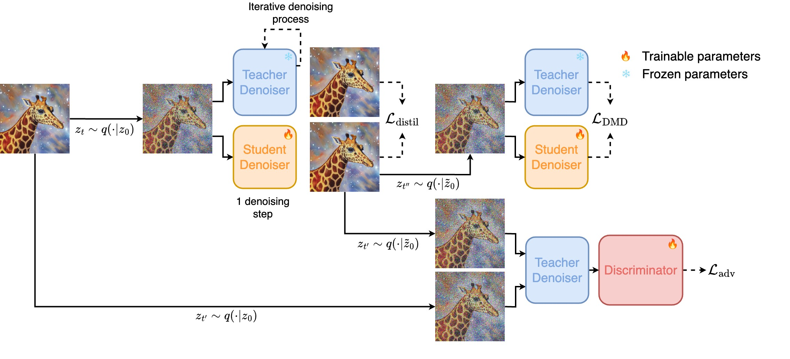
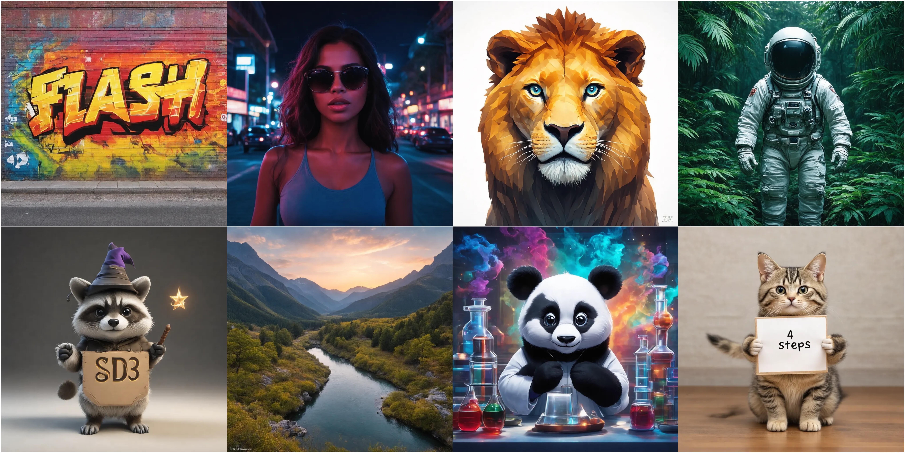
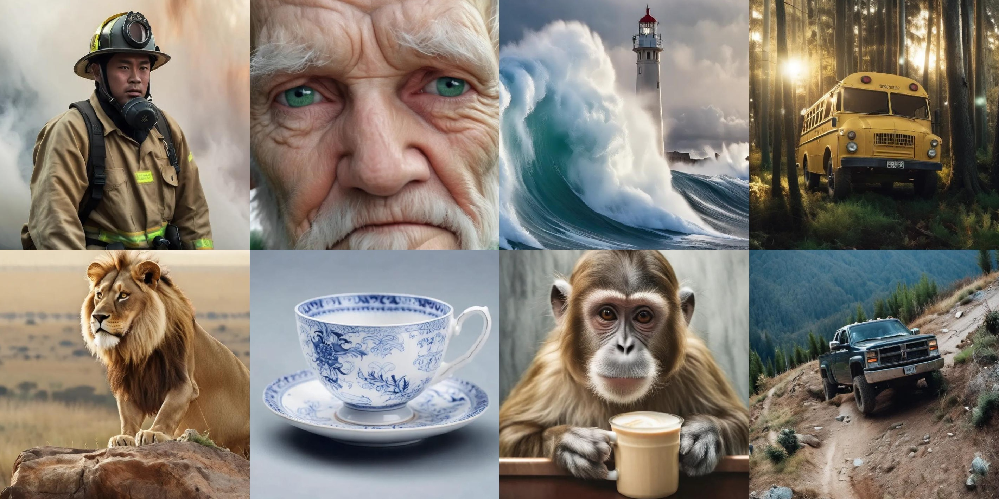
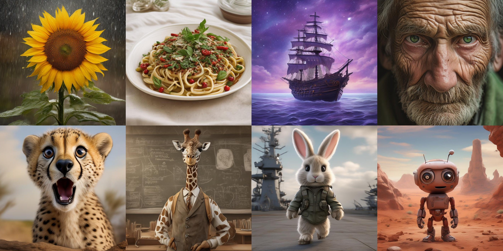
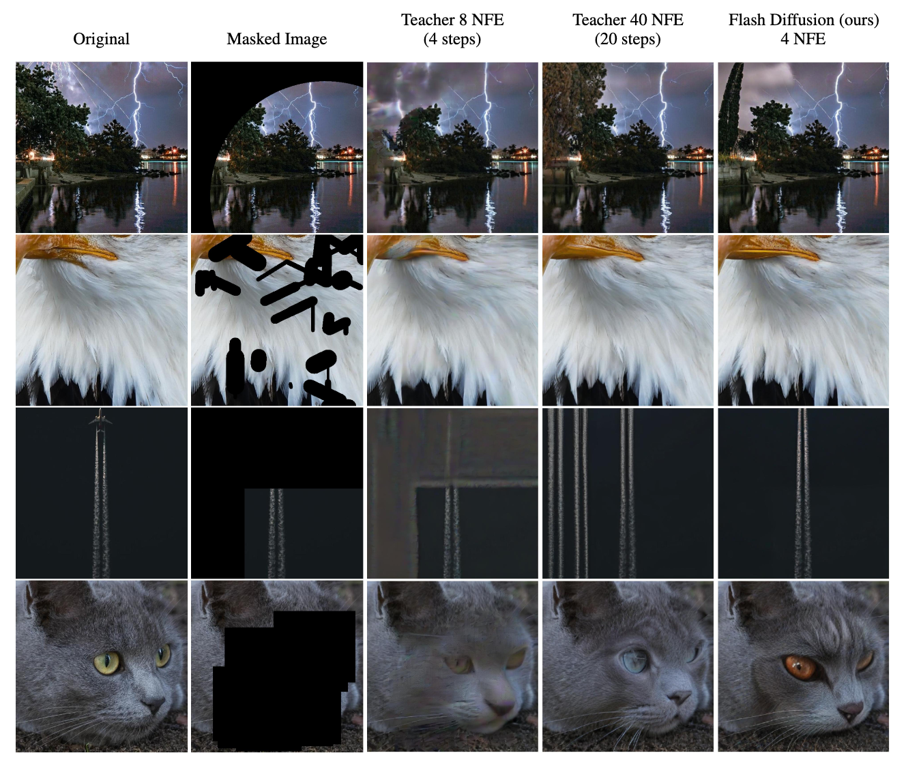
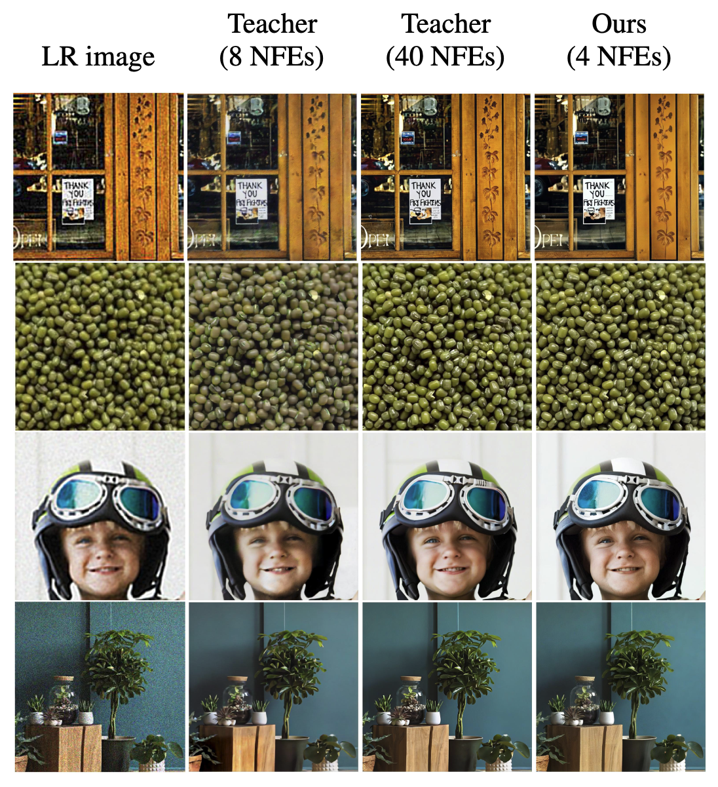
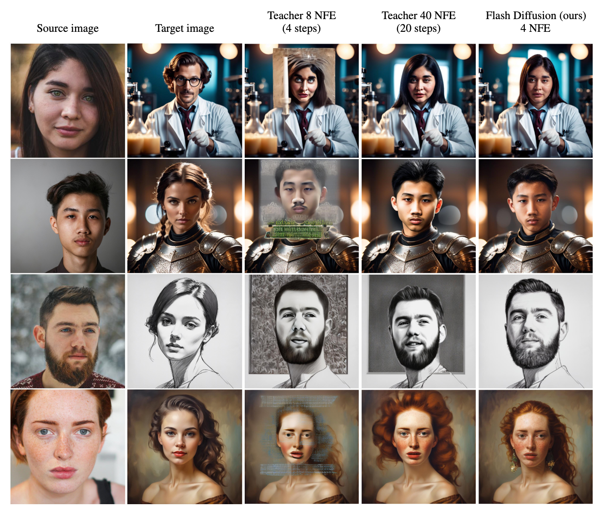
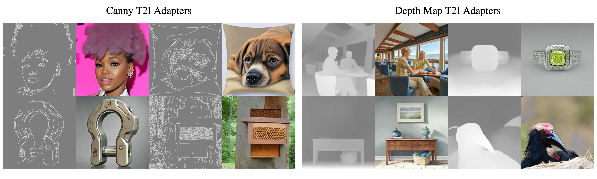

# ⚡ Flash Diffusion ⚡

This repository is the official implementation of the paper [Flash Diffusion: Accelerating Any Conditional Diffusion Model for Few Steps Image Generation](http://arxiv.org/abs/2406.02347).

<p align="center">
    <a href="http://arxiv.org/abs/2406.02347">
	    
	</a>
    <a href="https://gojasper.github.io/flash-diffusion-project/">
	    
	</a>
    <a href="https://huggingface.co/spaces/jasperai/flash-diffusion">
	    
	</a>
    <a href="https://huggingface.co/spaces/jasperai/flash-sd3">
	    
	</a>
    <a href='https://creativecommons.org/licenses/by-nd/4.0/legalcode'>
	    
	</a>
        <br>
    <a href="https://huggingface.co/jasperai/flash-sd">
	    
	</a>
	<a href="https://huggingface.co/jasperai/flash-sdxl">
	    
	</a>
	<a href="https://huggingface.co/jasperai/flash-pixart">
	    
	</a>
    	<a href="https://huggingface.co/jasperai/flash-sd3">
	    
	</a>
</p>

<figure>
	<p align="center">
        	
			<figcaption>
				<p align="center">
					<b>Images generated using 4 NFEs</b>
			 	</p>
			</figcaption>
	 </p>
</figure>


In this paper, we propose an efficient, fast, versatile and LoRA-compatible distillation method to accelerate the generation of pre-trained diffusion models: *Flash Diffusion*. The method reaches state-of-the-art performances in terms of FID and CLIP-Score for few steps image generation on the COCO 2014 and COCO 2017 datasets, while requiring only **several GPU hours of training** and fewer trainable parameters than existing methods. In addition to its efficiency, the versatility of the method is also exposed across several tasks such as text-to-image, inpainting, face-swapping, super-resolution and using different diffusion models backbones either using a UNet-based denoisers (SD1.5, SDXL) or DiT (Pixart-α), as well as adapters. In all cases, the method allowed to reduce drastically the number of sampling steps while maintaining very high-quality image generation.

## Quick access
- [Method overview](#method)
- [Results overview](#results)
- [Installation 🛠️](#setup)
- [Text2Image model distillation](#distilling-existing-t2i-models)
- [Distilling a custom model 🚀](#example-of-a-distillation-training-with-a-custom-conditional-diffusion-model)
- [Inference with 🤗 Hugging Face pipelines](#inference-with-a-huggingface-pipeline-)
- [Citing this repository](#citation)

## Method

Our method aims to create a fast, reliable, and adaptable approach for various uses. We propose to train a student model to predict in a single step a denoised multiple-step teacher prediction of a corrupted input sample. Additionally, we sample timesteps from an adaptable distribution that shifts during training to help the student model target specific timesteps.

<p align="center">
        
</p>


## Results

<it>Flash Diffusion</it> is compatible with various backbones such as
- [Flash Stable Diffusion 3](https://huggingface.co/jasperai/flash-sd3), distilled from a [Stable Diffusion 3 teacher](https://huggingface.co/stabilityai/stable-diffusion-3-medium)
- [Flash SDXL](https://huggingface.co/jasperai/flash-sdxl), distilled from a [SDXL teacher](https://huggingface.co/stabilityai/stable-diffusion-xl-base-1.0)
- [Flash Pixart (DiT)](https://huggingface.co/jasperai/flash-pixart), distilled from a [Pixart-α teacher](https://huggingface.co/PixArt-alpha/PixArt-XL-2-1024-MS)
- [Flash SD](https://huggingface.co/jasperai/flash-sd), distilled from a [SD1.5 teacher](https://huggingface.co/runwayml/stable-diffusion-v1-5)

### Varying backbones for *Text-to-image*
<details>
    <summary><b>Flash Stable Diffusion 3</b></summary>
<figure>
	<p align="center">
        	
			<figcaption>
				<p align="center">
					<b>Images generated using 4 NFEs</b>
			 	</p>
			</figcaption>
	 </p>
</figure>
</details>
<details>
    <summary><b>Flash SDXL</b></summary>
<figure>
	<p align="center">
        	
			<figcaption>
				<p align="center">
					<b>Images generated using 4 NFEs</b>
			 	</p>
			</figcaption>
	 </p>
</figure>
</details>
<details>
    <summary><b>Flash Pixart (DiT)</b></summary>
<figure>
	<p align="center">
        	
			<figcaption>
				<p align="center">
					<b>Images generated using 4 NFEs</b>
			 	</p>
			</figcaption>
	 </p>
</figure>
</details>
<details>
    <summary><b>Flash SD</b></summary>
<figure>
	<p align="center">
        	
			<figcaption>
				<p align="center">
					<b>Images generated using 4 NFEs</b>
			 	</p>
			</figcaption>
	 </p>
</figure>
</details>

### Varying Use-cases
<details>
    <summary><b>Image-inpainting</b></summary>
    <p align="center">
            
    </p>
</details>
<details>
    <summary><b>Image-upscaling</b></summary>
    <p align="center">
            
    </p>
</details>
<details>
    <summary><b>Face-swapping</b></summary>
    <p align="center">
            
    </p>
</details>
<details>
    <summary><b>T2I-Adapters</b></summary>
    <p align="center">
            
    </p>
</details>

## Setup
To be up and running, you need first to create a virtual env with at least `python3.10` installed and activate it

### With `venv`

```bash
python3.10 -m venv envs/flash_diffusion
source envs/flash_diffusion/bin/activate
```

### With `conda`

```bash
conda create -n flash_diffusion python=3.10
conda activate flash_diffusion
```

Then install the required dependencies (if on GPU) and the repo in editable mode

```bash
pip install --upgrade pip
pip install -r requirements.txt
pip install -e .
```

## Distilling existing T2I models
The main scripts to reproduce the main experiments of the paper are located in the `examples`. We provide 4 diffirent scripts:
- `train_flash_sd3.py`: Distils [SD3 model](https://huggingface.co/stabilityai/stable-diffusion-3-medium)
- `train_flash_sdxl.py`: Distils [SDXL model](https://huggingface.co/stabilityai/stable-diffusion-xl-base-1.0)
- `train_flash_pixart`: Distils [Pixart-α model](https://huggingface.co/PixArt-alpha/PixArt-XL-2-1024-MS)
- `train_flash_canny_adapter.py`: Distils a [T2I Canny Adapter](https://huggingface.co/TencentARC/t2i-adapter-canny-sdxl-1.0?library=true)
- `train_flash_sd.py`: Distils [SD1.5 model](https://huggingface.co/runwayml/stable-diffusion-v1-5)

In `examples\configs`, you will find the configuration `yaml` associated to each script. The only thing you need is to amend the `SHARDS_PATH_OR_URLS` section of the `yaml` so the model is trained on your own data. Please note that this package uses [`webdataset`](https://github.com/webdataset/webdataset) to handle the datastream and so the urls you use should be fomatted according to the  [`webdataset format`](https://github.com/webdataset/webdataset?tab=readme-ov-file#the-webdataset-format). In particular, for those 4 examples, each sample needs to be composed of a `jpg` file containing the image and a `json` file containing the caption under the key `caption` and the image aesthetics score `aesthetic_score`:

```
sample = {
    "jpg": dummy_image,
    "json": {
        "caption": "dummy caption",
        "aesthetic_score": 6.0
    }
}
```


The scripts can then be launched by simply runing

```bash
# Set the number of gpus & nodes you want to use
export SLURM_NPROCS=1
export SLURM_NNODES=1

# Distills SD1.5
python3.10 examples/train_flash_sd.py

# Distills SDXL1.0
python3.10 examples/train_flash_sdxl.py

# Distills Pixart-α
python3.10 examples/train_flash_pixart.py

# Distills T2I Canny adapter
python3.10 examples/train_flash_canny_adapter.py
```


## Example of a distillation training with a custom conditional diffusion model

This package is also intended to support custom model distillation. 

```python
from copy import deepcopy
from flash.models.unets import DiffusersUNet2DCondWrapper
from flash.models.vae import AutoencoderKLDiffusers, AutoencoderKLDiffusersConfig
from flash.models.embedders import (
    ClipEmbedder,
    ClipEmbedderConfig,
    ClipEmbedderWithProjection,
    ConditionerWrapper,
)

# Create the VAE
vae_config = AutoencoderKLDiffusersConfig(
	"stabilityai/sdxl-vae" # VAE for HF Hub
) 
vae = AutoencoderKLDiffusers(config=vae_config)

## Create the Conditioners ##
# A Clip conditioner returning 2 types of conditioning
embedder_1_config = ClipEmbedderConfig(
    version="stabilityai/stable-diffusion-xl-base-1.0", # from HF Hub
    text_embedder_subfolder="text_encoder_2",
    tokenizer_subfolder="tokenizer_2",
    input_key="text",
    always_return_pooled=True, # Return a 1-dimensional tensor
)
embeddder_1 = ClipEmbedder(config=embedder_1_config)

# Embedder acting on a lr image injected in the UNET via concatenation
embedder_2_config = TorchNNEmbedderConfig(
    nn_modules=["torch.nn.Conv2d"],
    nn_modules_kwargs=[
       dict(
          in_channels=3,
	  out_channels=6,
          kernel_size=3,
          padding=1,
          stride=2,
       ),
    ],
    input_key="downsampled_image",
    unconditional_conditioning_rate=request.param,
)
embedder_2 = TorchNNEmbedder(config=embedder_2_config)

conditioner_wrapper = ConditionerWrapper(
    conditioners=[embedder1, embedder2]
)

# Create the Teacher denoiser
unet = DiffusersUNet2DCondWrapper(
    in_channels=4 + 6,  # VAE channels + concat conditioning
    out_channels=4,  # VAE channels
    cross_attention_dim=1280,  # cross-attention conditioning
    projection_class_embeddings_input_dim=1280,  # add conditioning
    class_embed_type="projection",
)

# Load the teacher weights
...

# Create the student denoiser
student_denoiser = deepcopy(teacher_denoiser)
```

## Inference with a Hugging Face pipeline 🤗

```python
import torch
from diffusers import PixArtAlphaPipeline, Transformer2DModel, LCMScheduler
from peft import PeftModel

# Load LoRA
transformer = Transformer2DModel.from_pretrained(
    "PixArt-alpha/PixArt-XL-2-1024-MS",
    subfolder="transformer",
    torch_dtype=torch.float16
)
transformer = PeftModel.from_pretrained(
    transformer,
    "jasperai/flash-pixart"
)

# Pipeline
pipe = PixArtAlphaPipeline.from_pretrained(
    "PixArt-alpha/PixArt-XL-2-1024-MS",
    transformer=transformer,
    torch_dtype=torch.float16
)

# Scheduler
pipe.scheduler = LCMScheduler.from_pretrained(
    "PixArt-alpha/PixArt-XL-2-1024-MS",
    subfolder="scheduler",
    timestep_spacing="trailing",
)

pipe.to("cuda")

prompt = "A raccoon reading a book in a lush forest."

image = pipe(prompt, num_inference_steps=4, guidance_scale=0).images[0]
```

# License
This code is released under the [Creative Commons BY-NC 4.0 license](https://creativecommons.org/licenses/by-nc/4.0/legalcode.en).

# Citation
If you find this work useful or use it in your research, please consider citing us

```bibtex
@misc{chadebec2024flash,
      title={Flash Diffusion: Accelerating Any Conditional Diffusion Model for Few Steps Image Generation}, 
      author={Clement Chadebec and Onur Tasar and Eyal Benaroche and Benjamin Aubin},
      year={2024},
      eprint={2406.02347},
      archivePrefix={arXiv},
      primaryClass={cs.CV}
}
```
